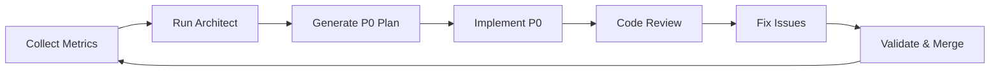
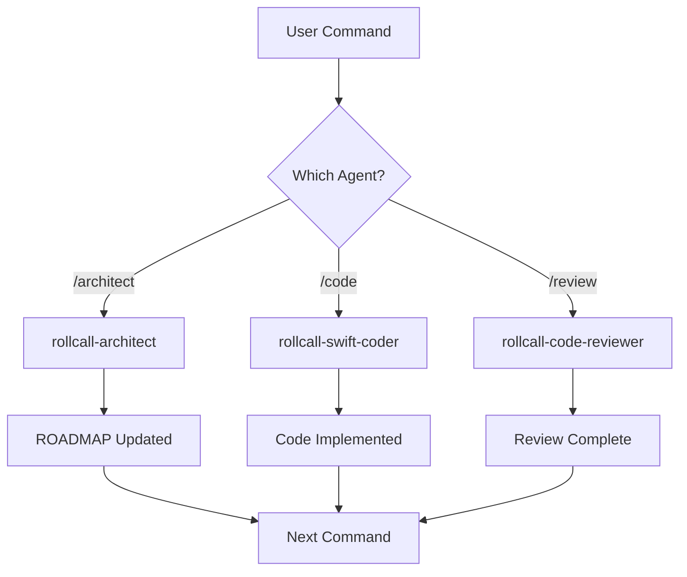

# RollCall Automated Development System

## 🚀 Quick Start

The RollCall project uses Claude Code's slash command system to automate the entire development workflow. Simply type `/` followed by a command name to execute complex development tasks.

```bash
# Start your day
/morning

# Check current status
/status

# Implement next P0 item
/code

# Validate before committing
/validate
```

---

## 📋 Table of Contents

1. [System Overview](#system-overview)
2. [Getting Started](#getting-started)
3. [Core Development Loop](#core-development-loop)
4. [Command Reference](#command-reference)
5. [Workflow Examples](#workflow-examples)
6. [Agent Integration](#agent-integration)
7. [Troubleshooting](#troubleshooting)

---

## System Overview

### Architecture

The RollCall Automated Development System consists of:

1. **Claude Commands** (`.claude/commands/`) - Slash commands for workflow automation
2. **Specialized Agents** (`.claude/agents/`) - AI agents for specific tasks:
   - `rollcall-architect` - ROADMAP and P0 planning
   - `rollcall-swift-coder` - TDD implementation
   - `rollcall-code-reviewer` - Code review and compliance
   - `rollcall-auditor` - Comprehensive auditing

3. **P0 Loop Process** - Iterative development cycle:
   ```
   Metrics → Architect → Code → Review → Fix → Merge → Repeat
   ```

### Key Concepts

- **P0 Items**: Priority zero tasks that unblock MVP (3-7 atomic, testable tasks)
- **ROADMAP Anchors**: Auto-managed sections in ROADMAP.md
- **CI Metrics**: Build status, test coverage, lint violations
- **DoD (Definition of Done)**: Checklist for task completion

---

## Getting Started

### Prerequisites

1. **Install Required Tools**:
   ```bash
   # Install SwiftLint and SwiftFormat
   brew install swiftlint swiftformat
   
   # Install GitHub CLI (for PR creation)
   brew install gh
   
   # Ensure Xcode is installed
   xcode-select --install
   ```

2. **Clone Repository**:
   ```bash
   git clone <repository-url>
   cd rollcall-dev
   ```

3. **Verify Setup**:
   ```bash
   # In Claude Code, type:
   /status
   ```

### First Time Setup

1. **Morning Routine**:
   ```bash
   /morning
   ```
   This command:
   - Pulls latest changes
   - Generates current metrics
   - Validates workspace
   - Shows P0 progress
   - Sets up development environment

2. **Check Available Commands**:
   ```bash
   /help
   ```

---

## Core Development Loop

### The P0 Loop

The P0 loop is the heart of RollCall's automated development. It ensures continuous progress toward MVP.



### Automated Loop Command

Execute the entire cycle with one command:
```bash
/loop
```

This runs:
1. **Metrics Collection** - Current build/test/coverage status
2. **Architect Agent** - Updates ROADMAP, generates P0 Plan
3. **Code Implementation** - TDD implementation of next P0
4. **Review Process** - Comprehensive code review
5. **Issue Resolution** - Fix any findings
6. **Validation** - Ensure all checks pass

### Manual Step-by-Step

For more control, run each step individually:

```bash
# 1. Generate metrics
/metrics

# 2. Run architect to update ROADMAP
/architect

# 3. Check current P0 items
/p0 list

# 4. Implement next P0
/code

# 5. Review implementation
/review

# 6. Fix any issues
/fix

# 7. Validate everything
/validate full

# 8. Create PR
/pr create
```

---

## Command Reference

### 🔄 Core Loop Commands

#### `/loop`
Runs the complete P0 development cycle automatically.
```bash
/loop
```

#### `/status`
Shows current development status including metrics, P0 progress, and blockers.
```bash
/status          # Full status
/status build    # Build status only
/status p0       # P0 progress only
```

#### `/metrics [mode]`
Generates CI metrics for the project.
```bash
/metrics         # Full metrics (default)
/metrics quick   # Quick check only
/metrics export  # Generate report
```

### 🏗️ Architecture & Planning

#### `/architect`
Runs the architect agent to update ROADMAP and generate P0 Plan.
```bash
/architect           # Normal run
/architect refresh   # Force regeneration
/architect dry-run   # Preview changes
```

#### `/p0 [action]`
Manages P0 items for MVP development.
```bash
/p0                           # List all P0 items
/p0 current                   # Show current P0
/p0 next                      # Show next P0
/p0 done RC-P0-015           # Mark as complete
/p0 block RC-P0-016 "reason" # Block with reason
```

### 💻 Development Commands

#### `/code [P0-ID]`
Implements P0 item using TDD and MVVM-C patterns.
```bash
/code                # Implement current/next P0
/code RC-P0-015      # Implement specific P0
/code next           # Explicitly get next P0
```

#### `/tdd [feature]`
Guides through test-driven development workflow.
```bash
/tdd                      # TDD guide
/tdd CreateRollViewModel  # TDD for specific feature
```

#### `/review [scope]`
Runs comprehensive code review.
```bash
/review          # Review current changes
/review 123      # Review PR #123
/review all      # Review all uncommitted
/review staged   # Review staged only
```

### ✅ Validation Commands

#### `/validate [mode]`
Smart validation based on changes.
```bash
/validate         # Smart mode (default)
/validate quick   # Format + lint only
/validate build   # Include compilation
/validate full    # Include all tests
```

#### `/quick`
Rapid format and lint check (<5 seconds).
```bash
/quick
```

### 🔧 Fix Commands

#### `/fix [target]`
Auto-fixes common issues.
```bash
/fix             # Fix all issues
/fix ci          # Fix CI failures
/fix timeout     # Fix test timeouts
/fix lint        # Fix lint violations
/fix review      # Fix review findings
```

#### `/panic [situation]`
Emergency recovery procedures.
```bash
/panic           # General recovery
/panic build     # Fix broken build
/panic test      # Fix hanging tests
/panic merge     # Fix merge conflicts
/panic deploy    # Fix deployment
```

### 🚀 Workflow Commands

#### `/morning`
Daily startup routine.
```bash
/morning
```

#### `/pr [action]`
Pull request management.
```bash
/pr              # Check PR readiness
/pr create       # Create new PR
/pr check        # Verify PR status
/pr update       # Update after feedback
```

#### `/ship [type]`
Deployment preparation.
```bash
/ship            # Auto-detect type
/ship feature    # Ship feature
/ship hotfix     # Ship emergency fix
/ship release    # Ship version release
```

---

## Workflow Examples

### Example 1: Daily Development Flow

```bash
# Start your day
/morning

# Continue working on current P0
/code

# Quick validation during development
/quick

# Full validation before commit
/validate

# Create PR when ready
/pr create
```

### Example 2: Starting New P0 Item

```bash
# Check available P0 items
/p0 list

# Start implementation
/code RC-P0-016

# Follow TDD approach
/tdd FeedPagination

# Validate implementation
/validate full

# Create PR
/pr create
```

### Example 3: Fixing CI Failures

```bash
# Check what's broken
/status

# Auto-fix CI issues
/fix ci

# If still broken, panic mode
/panic build

# Validate fixes
/validate full

# Update PR
/pr update
```

### Example 4: Complete Automation

```bash
# Run entire cycle
/loop

# This automatically:
# - Collects metrics
# - Updates ROADMAP
# - Implements next P0
# - Reviews code
# - Fixes issues
# - Validates everything
```

---

## Agent Integration

### Available Agents

#### 🏗️ rollcall-architect
- Updates ROADMAP.md anchors
- Generates P0 Plan JSON
- Manages project roadmap
- Invoked by: `/architect`, `/loop`

#### 💻 rollcall-swift-coder
- Implements P0 items using TDD
- Follows MVVM-C architecture
- Creates production-ready Swift code
- Invoked by: `/code`, `/fix`

#### 👁️ rollcall-code-reviewer
- Reviews code changes
- Checks MVVM-C compliance
- Verifies test coverage
- Invoked by: `/review`, `/loop`

#### 🔍 rollcall-auditor
- Comprehensive codebase audit
- Architecture compliance check
- Performance analysis
- Invoked by: `/audit` (manual)

### Agent Workflow



---

## Troubleshooting

### Common Issues

#### Commands Not Appearing
```bash
# Restart Claude Code
# Commands are loaded on startup
```

#### Build Failures
```bash
# Use panic mode
/panic build

# Or targeted fix
/fix ci
```

#### Test Timeouts
```bash
# Specific timeout fix
/fix timeout

# Or check for hanging tests
/panic test
```

#### SwiftLint Violations
```bash
# Auto-fix most issues
/fix lint

# Or quick check
/quick
```

### Debug Commands

```bash
# Check current state
/status

# Verify metrics
/metrics quick

# List P0 blockers
/p0 list

# Emergency recovery
/panic
```

### Getting Help

```bash
# Show all commands
/help

# Check command details
# Look in .claude/commands/<command>.md
```

---

## Best Practices

### 1. Daily Workflow
- Start with `/morning`
- Use `/quick` frequently during development
- Run `/validate` before committing
- Always `/pr create` for proper format

### 2. P0 Implementation
- Let `/architect` manage the ROADMAP
- Implement one P0 at a time with `/code`
- Follow TDD approach with `/tdd`
- Complete DoD checklist before marking done

### 3. Quality Assurance
- Maintain 0 SwiftLint violations
- Keep test coverage >80%
- Review all code with `/review`
- Fix issues immediately with `/fix`

### 4. Automation
- Use `/loop` for hands-free development
- Trust the agents' decisions
- Let metrics drive priority
- Maintain clean git history

---

## Configuration

### Required Files

1. **ROADMAP.md** - Contains P0 tasks and anchors
2. **CLAUDE.md** - Development guidelines
3. **ci-metrics.json** - Current metrics (auto-generated)
4. **.claude/agents/** - Agent configurations
5. **.claude/commands/** - Command definitions

### Environment Setup

```bash
# Required tools
brew install swiftlint swiftformat gh jq

# Xcode configuration
xcode-select --install
open RollCall/RollCall.xcodeproj

# Git configuration
git config user.name "Your Name"
git config user.email "your.email@example.com"
```

---

## Advanced Usage

### Custom Workflows

Create compound commands by chaining:
```bash
# Morning + immediate coding
/morning && /code

# Fix everything and ship
/fix all && /validate full && /ship
```

### Parallel Execution

Some commands can run in parallel:
```bash
# In separate Claude Code instances
# Instance 1: /metrics
# Instance 2: /validate
```

### Batch Operations

Process multiple P0 items:
```bash
# Complete current and start next
/p0 done RC-P0-015 && /code RC-P0-016
```

---

## Summary

The RollCall Automated Development System streamlines iOS app development through:

1. **Intelligent Automation** - Agents handle complex tasks
2. **Consistent Workflow** - Standardized P0 loop process
3. **Quality Gates** - Automatic validation and review
4. **Rapid Iteration** - Quick feedback cycles

Simply type `/` to access any command and let the system guide you through professional iOS development with RollCall.

---

## Quick Reference Card

```
Daily Commands:
  /morning     - Start your day
  /status      - Check progress
  /code        - Implement P0
  /validate    - Check quality
  /pr create   - Submit work

Fix Commands:
  /quick       - Fast check
  /fix         - Auto-repair
  /panic       - Emergency

Management:
  /p0          - Manage items
  /metrics     - Track progress
  /loop        - Full automation
```

For detailed help, type `/help` in Claude Code.