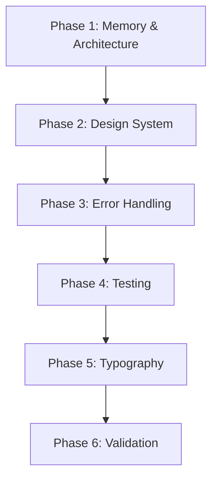

# 🎯 RollCall Critical Fixes Plan

## Executive Summary
This plan addresses all critical issues identified in the QCHECK review, prioritizing memory safety, architectural compliance, and design system adherence. The implementation will be phased to ensure stability at each step.

---

## Phase 1: Critical Memory & Architecture Fixes (High Priority) 🚨

### 1.1 Fix Memory Leaks in ViewModels
**Issue**: Task closures without `[weak self]` create retain cycles  
**Affected Files**:
- `WelcomeViewModel.swift` (lines 41-47)
- `OnboardingViewModel.swift` (lines 50-52, 62-64, 73-75, 89-91)

**Solution**:
```swift
// Pattern to implement:
animationTask = Task { [weak self] in
    await self?.performAnimationSequence()
}
```

### 1.2 Fix @MainActor Violations
**Issue**: Incorrect @MainActor usage pattern  
**Affected Files**:
- `MainTabViewModel.swift` (entire methods marked with @MainActor)
- `OnboardingViewModel.swift` (missing @MainActor handling)

**Solution**: Follow WelcomeViewModel pattern:
```swift
// Remove @MainActor from method signature
public func onTabSelected(_ tab: Tab) async {
    await MainActor.run {
        updateViewState { ... }
    }
}
```

### 1.3 Update CLAUDE.md with Weak Self Guidelines
Add new rule CG-6 for Task weak self requirements based on the patterns discovered.

---

## Phase 2: Design System Compliance (High Priority) 🎨

### 2.1 Create Design Token Infrastructure
**New Files**:
- `DesignTokens.swift` - Central token definitions
- `Typography.swift` - Font system implementation
- `Spacing.swift` - 4pt grid constants
- `Animation.swift` - Standard timing curves

### 2.2 Fix Animation Durations
**Violations**: 9 animation violations using incorrect durations  
**Solution**: 
- Standard transitions: 200ms (0.2s)
- Celebratory animations: 400ms (0.4s)
- Create `AnimationDuration` enum with these values

### 2.3 Fix Spacing Grid Violations
**Key Fix**: `OnboardingContainerView.swift` line 57: 50 → 48 or 52

### 2.4 Fix Stroke Width Violations
**All strokes**: Update to 2pt per IC-1 requirement

### 2.5 Implement Proper Shadows
**Create**: `ShadowToken` struct with CD-1 and CD-2 specifications

---

## Phase 3: Error Handling & Service Integration (Medium Priority) ⚠️

### 3.1 Implement Result Types
**Pattern**:
```swift
func performAction() async -> Result<Success, AppError>
```

### 3.2 Add Error States to ViewModels
- Proper error propagation
- User-friendly error messages
- Recovery actions

### 3.3 Integrate Real Services
- Connect AuthService
- Implement RollService
- Add RestaurantService

---

## Phase 4: Testing Infrastructure (Medium Priority) 🧪

### 4.1 Fix Async Test Patterns
- Remove arbitrary sleep delays
- Use proper XCTestExpectation
- Add timeout handling per G-8/G-9

### 4.2 Add Comprehensive Test Coverage
- Error path testing
- Task cancellation tests
- Boundary condition tests
- Service failure scenarios

### 4.3 Create Test Helpers
- Async test utilities
- Mock service builders
- State verification helpers

---

## Phase 5: Typography & Custom Fonts (Low Priority) 📝

### 5.1 Implement Custom Fonts
- Add Poppins SemiBold for headers
- Add Inter Regular for body text
- Create font registration system

### 5.2 Dynamic Type Support
- Implement @ScaledMetric
- Test with accessibility sizes
- Ensure proper text truncation

---

## Phase 6: Validation & Documentation (Low Priority) ✅

### 6.1 Update Validation Scripts
- Add design token compliance checks
- Memory leak detection
- Architecture compliance verification

### 6.2 Documentation Updates
- Update CLAUDE.md with new patterns
- Create design token usage guide
- Document testing best practices

---

## Implementation Order & Dependencies



### Critical Path:
1. **Week 1**: Phase 1 (Memory & Architecture) - MUST complete first
2. **Week 1-2**: Phase 2 (Design System) - Parallel with Phase 1 completion
3. **Week 2**: Phase 3 (Error Handling) - After architecture is stable
4. **Week 3**: Phase 4 (Testing) - Once services are integrated
5. **Week 3-4**: Phase 5 & 6 - Polish and validation

---

## Success Criteria

### Phase 1 ✓
- [ ] No retain cycles in ViewModels
- [ ] Consistent @MainActor usage pattern
- [ ] All Tasks use [weak self] where appropriate
- [ ] CLAUDE.md updated with new guidelines

### Phase 2 ✓
- [ ] All animations use correct durations
- [ ] 4pt spacing grid compliance
- [ ] 2pt stroke widths throughout
- [ ] Proper shadow implementation
- [ ] Design tokens centralized

### Phase 3 ✓
- [ ] Result types for all async operations
- [ ] Comprehensive error handling
- [ ] Real service integration
- [ ] Error recovery patterns

### Phase 4 ✓
- [ ] >80% test coverage achieved
- [ ] All async tests use proper patterns
- [ ] Error paths tested
- [ ] No test flakiness

### Phase 5 ✓
- [ ] Custom fonts implemented
- [ ] Dynamic Type support
- [ ] WCAG AAA where feasible
- [ ] Text scaling tested

### Phase 6 ✓
- [ ] Automated compliance checks
- [ ] Complete documentation
- [ ] CI/CD integration
- [ ] Validation scripts updated

---

## Risk Mitigation

1. **Memory Leaks**: Fix immediately in Phase 1
2. **Design Regressions**: Create automated checks
3. **Test Flakiness**: Proper async patterns
4. **Breaking Changes**: Incremental refactoring

---

## Estimated Effort

- **Phase 1**: 2-3 days (Critical)
- **Phase 2**: 3-4 days (High complexity)
- **Phase 3**: 2-3 days (Medium complexity)
- **Phase 4**: 3-4 days (Comprehensive testing)
- **Phase 5**: 1-2 days (Low complexity)
- **Phase 6**: 1-2 days (Documentation)

**Total**: 12-18 days for complete implementation

---

## Progress Tracking

### Phase 1 Progress ✅ COMPLETE
- [x] 1.1 Fix memory leaks in WelcomeViewModel
- [x] 1.1 Fix memory leaks in OnboardingViewModel
- [x] 1.2 Fix @MainActor in MainTabViewModel
- [x] 1.2 Add @MainActor handling to OnboardingViewModel
- [x] 1.3 Update CLAUDE.md with CG-6 rule
- [x] Run tests to verify no regressions
- [x] Fix ALL Task closures in ViewModels and Coordinators
  - [x] MainTabViewModel - 4 Task closures fixed
  - [x] AppCoordinator - 2 Task closures fixed
  - [x] OnboardingCoordinator - 1 Task closure fixed

### Phase 2 Progress
- [ ] 2.1 Create DesignTokens.swift
- [ ] 2.1 Create Typography.swift
- [ ] 2.1 Create Spacing.swift
- [ ] 2.1 Create Animation.swift
- [ ] 2.2 Fix all animation duration violations
- [ ] 2.3 Fix spacing grid violations
- [ ] 2.4 Fix stroke width violations
- [ ] 2.5 Implement shadow tokens
- [ ] Update all UI files to use tokens
- [ ] Visual regression testing

### Phase 3 Progress
- [ ] 3.1 Add Result types to service protocols
- [ ] 3.1 Update ViewModels to handle Results
- [ ] 3.2 Add error states to all ViewModels
- [ ] 3.2 Implement error recovery flows
- [ ] 3.3 Integrate AuthService
- [ ] 3.3 Implement RollService
- [ ] 3.3 Implement RestaurantService
- [ ] Integration testing

### Phase 4 Progress
- [ ] 4.1 Remove sleep delays from tests
- [ ] 4.1 Add proper expectations
- [ ] 4.2 Add error path tests
- [ ] 4.2 Add cancellation tests
- [ ] 4.2 Add boundary tests
- [ ] 4.3 Create AsyncTestCase base class
- [ ] 4.3 Create mock builders
- [ ] Coverage report generation

### Phase 5 Progress
- [ ] 5.1 Add Poppins font files
- [ ] 5.1 Add Inter font files
- [ ] 5.1 Create font registration
- [ ] 5.2 Implement @ScaledMetric
- [ ] 5.2 Test with Large Text
- [ ] Accessibility audit

### Phase 6 Progress
- [ ] 6.1 Create design-check.sh script
- [ ] 6.1 Create memory-check.sh script
- [ ] 6.2 Update CLAUDE.md
- [ ] 6.2 Create DESIGN_TOKENS.md
- [ ] 6.2 Create TESTING_GUIDE.md
- [ ] Final validation run

---

This plan ensures we address all critical issues systematically while maintaining a working application throughout the refactoring process.